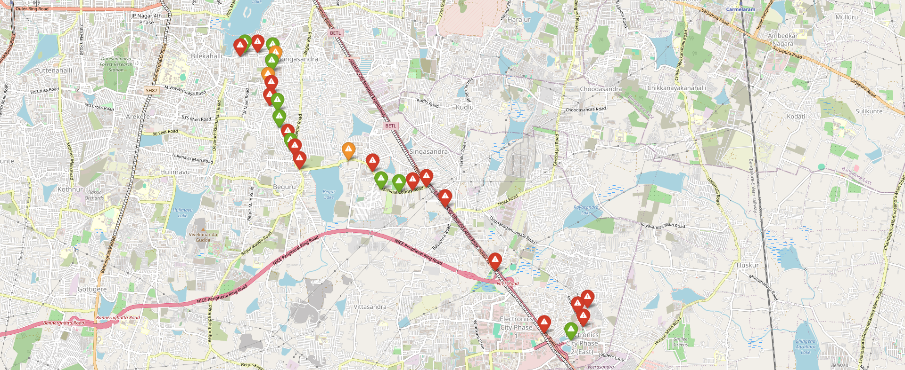

# 🚗 Pothole-Aware Route Optimizer 🚧


Welcome to the **Pothole-Aware Route Optimizer**! This project leverages advanced machine learning and geospatial data to provide the safest and smoothest routes for your travels. By analyzing pothole intensity and frequency, our algorithm recommends the optimal path from point A to point B, ensuring a comfortable journey.

## 🌟 Features

- **Pothole Detection**: Custom-trained Convolutional Neural Network (CNN) for accurate pothole detection.
- **Route Analysis**: Integrates with Google Maps API to evaluate all possible routes.
- **Pothole Intensity Mapping**: Uses PyTorch libraries to assess pothole severity.
- **Interactive Visualization**: Marks potholes on a custom Folium map.
- **User-Friendly Interface**: Terminal and web-based versions available.

## 🛠️ Technical Overview

### Pothole Detection Model
Our model is a finely-tuned CNN trained on a diverse dataset of pothole images. This allows us to accurately predict the presence of potholes in real-time.

### Route Optimization
Using the Google Maps API, we fetch all potential routes between the source and destination. Our algorithm overlays pothole data on these routes and assigns a score to each based on pothole intensity and frequency.

### Pothole Intensity Analysis
We employ PyTorch libraries to quantify the severity of detected potholes. This information is then visualized on an interactive Folium map, providing a clear overview of route conditions.

## 📋 Installation

Clone the repository and navigate to the project directory:

```sh
git clone https://github.com/SiddarthAA/Pothole-Routing.git
cd Pothole-Routing
```

Install the required dependencies:

```sh
pip install -r requirements.txt
```

## 🚀 Usage

### Terminal Version

To run the terminal version, execute:

```sh
python Main.py
```

### Web-Based Enhanced Version

To launch the web application, use:

```sh
streamlit run App.py
```

## 📚 Dependencies

- **Python 3.8+**
- **PyTorch**
- **Folium**
- **Streamlit**
- **Google Maps API**
- Additional dependencies listed in `requirements.txt`.

## 🎨 Visualization

Our web interface, built with Streamlit, provides an enhanced user experience. It displays real-time route analysis, highlighting pothole-prone areas and suggesting the best route to minimize discomfort and potential vehicle damage.



## 🌐 Integrations

- **Google Maps API**: Fetches real-time route data.
- **Custom CNN Model**: Detects and analyzes potholes.
- **Folium**: Interactive map visualization.

## 📖 Documentation

Comprehensive documentation is available in the `docs` directory. It includes detailed instructions on setup, usage, and customization.

## 🙌 Contributing

We welcome contributions from the community. Please read our [contributing guidelines](CONTRIBUTING.md) for more information.

## 📧 Contact

For inquiries, please contact [siddartha_ay@protonmail.com](mailto:siddartha_ay@protonmail.com).


Repo Owner [Siddartha A Yogesha](https://github.com/SiddarthAA).